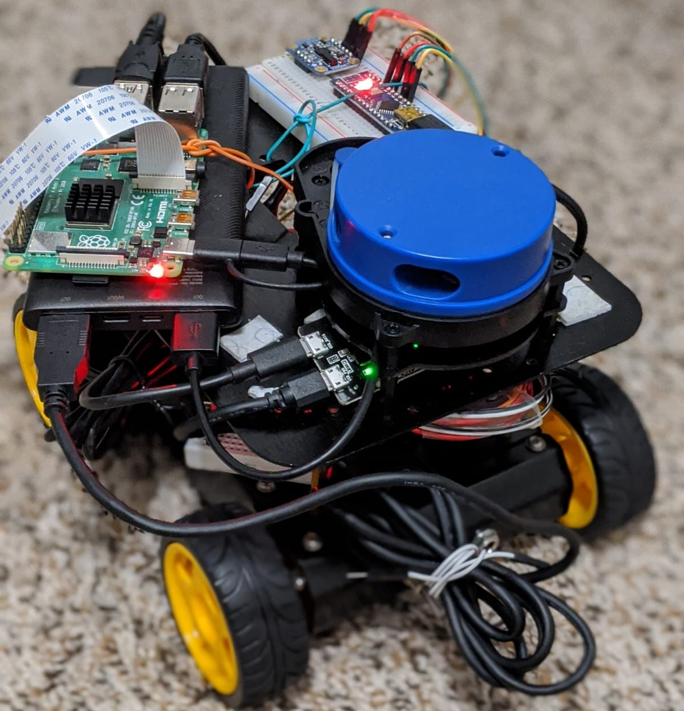
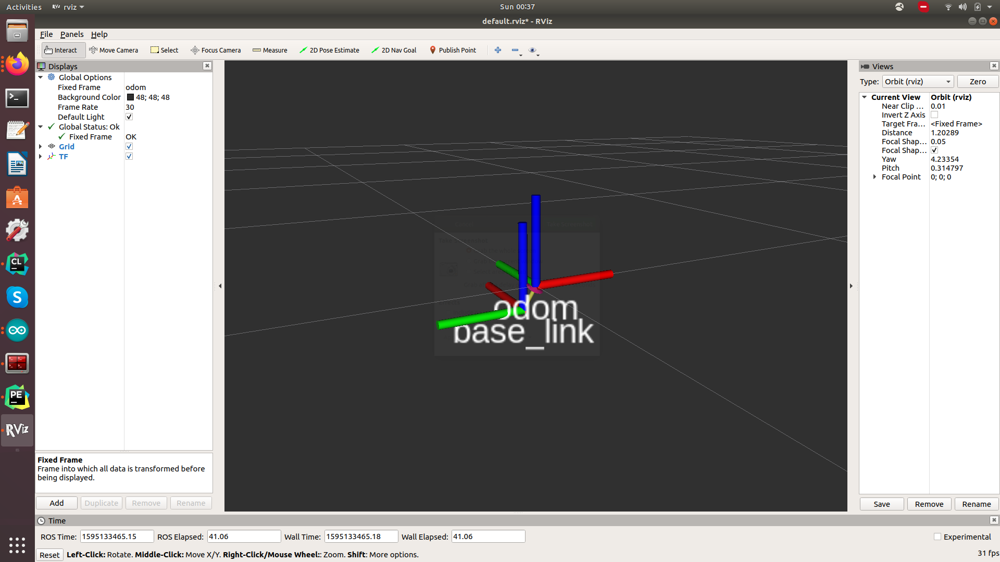
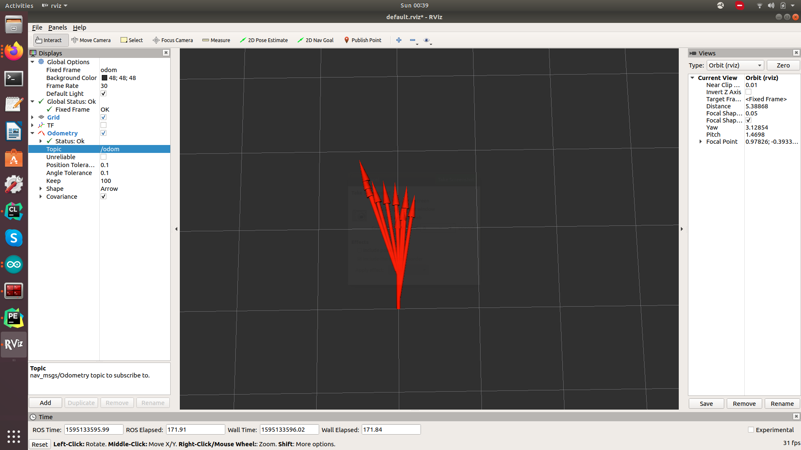

# ELSA - Explore, Localize, Map Simultaeneously and Act

<em>ELSA Robot</em>

## Project Dependencies

* To install teleop-twist-keyboard
  * `sudo apt-get install ros-melodic-teleop-twist-keyboard`

## Project information:
* The project has two packages `elsa` and `ros_arduino_bridge`
* Follow the below instructions to build the project
  * `cd ~/catkin_ws`
  * `source devel/setup.bash` 
  * `catkin_make --only-pkg-with-deps elsa`
  * `catkin_make --only-pkg-with-deps ros_arduino_bridge`
* Follow the below commands to execute the project
  * `roslaunch elsa elsabot.launch`
* Use the below command to do keyboard teleop
  * `rosrun teleop_twist_keyboard teleop_twist_keyboard.py`

## Docs:
* Coordinate Transformations and Robot Dimensions can be found at `docs/Robot dimensions and coordinate transformations.pdf`
* More info about the references used is provided in the reference section

## Finished tasks:

* Publish imu to `/imu/raw_data` topic 
* Publish encoder ticks to `/ticks_pub/lwheel_ticks` and `/ticks_pub/lwheel_ticks` topics
* Publish Odometry data to `/odom` topic
* Configured the ROS_Arduino_Bridge
* Debug the ROS_Arduino_Bridge
  * Solder Arduino Nano
  * Connect the Arduino Nano to the Motor_Driver
  * Edit the scripts for the second USB port (/dev/ttyUSB*)
* Publish encoder ticks to `/arduino/lwheel_ticks` and `/arduino/lwheel_ticks` topics
* Publish velocoties to `/cmd_vel` topic 
  * Publish sample Twist msg -- Seems like there's an error/lag
  * Debug the motor_driving  
* Finish the base_controller to subscribe to `/cmd_vel` topic to move the robot_base
* Write a node to Publish raw images to a ROS topic
  * Resolve cv_bridge and opencv4 issue for ROS - the issue is specific to ROS-melodic and OpenCV4 combination
* Transport Pi camaera v2 video stream using sensor_msgs/Image to a ROS topic
* Setup either YDLidar X4 for 2D map creation - needed extra cable to power the LIDAR, since the RPi cannot 
provide enough power to drive the LIDAR motor
* visualized the tf and odometry in rviz
  * Fix the odometry axis and tf axis alignment - made sure all the axis are aligning in same direction
* rename the coordinate frames of the ydlidar to match with our convention
* fix encoder direction
* fix the motor direction
* Use teleop_twist_keyboard to move the robot -- works perfectly
* Use robot_localization package to filter the Odometry msg using ekf_lozalisation node
  * check if everything is working as expected -- need to tweak covariance matrix for better estimation
* Fix the direction issue with rviz visualization -- Problem is with Odometry calculation -- robot_localization is solving this

## To Do:

* Tune the PID controller
* Use slam techniques for mapping - need to try Gmapping first 
* Use camera data to obtain the images to do SFM and build the 3D_point_cloud_map

## Results:

* The below image shows the `/base_link` and `/odom` coordinate frames and trasformations between them in rviz

<em>Coordinate Transformations (TF) in rviz</em>

* The below image shows the robot movement in rviz based on the odometry published to `/odom` topic

<em>Odometry of the ELSA Robot in rviz</em>

* The below image shows the laserscan from YDLIDAR X2 being pubilshed to `/scan`

<em>Laser Scan in rviz</em>

## References:
* The TF tree can be found at `elsa/docs/frames.pdf`
* The project uses the [ROSArduinoBridge](https://github.com/hbrobotics/ros_arduino_bridge) Package. However, many modifications are made according to the requirements
* The Project also uses the [SparkFun_RedBot_Arduino_Library](https://github.com/sparkfun/SparkFun_RedBot_Arduino_Library) Arduino Library. This library has been modified a little bit according to our requirement. The updated library can be found in `/elsa/elsa/arduino/`
* The Projects also uses few insights from the package [diff_drive](https://github.com/merose/diff_drive)
* The project refers several tutorials from [ROS wiki](http://wiki.ros.org/ROS/Tutorials) 
* The topics are published according to the coordinates frames as per [REP103 standards](https://www.ros.org/reps/rep-0103.html) and [REP105 standards](https://www.ros.org/reps/rep-0105.html)
* The YDLIDAR uses the package provided by EAI YDLIDAR [github](https://github.com/EAIBOT/ydlidar)
