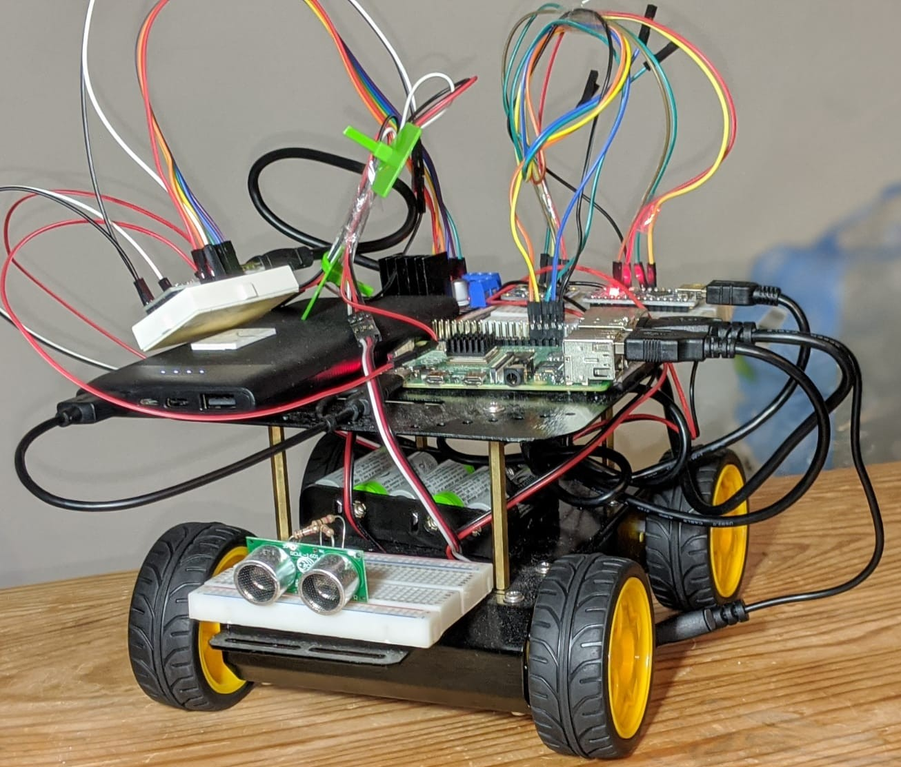

# ELSA - Explore, Localize, Map Simultaeneously and Act

<em>ELSA Robot</em>

## Finished tasks

* Publish imu to `/imu/raw_data` topic 
* Publish encoder ticks to `/ticks_pub/lwheel_ticks` and `/ticks_pub/lwheel_ticks` topics
* Publish Odometry data to `/odom` topic
* Configured the ROS_Arduino_Bridge
* Debug the ROS_Arduino_Bridge
  * Solder Arduino Nano
  * Connect the Arduino Nano to the Motor_Driver
  * Edit the scripts for the second USB port (/dev/ttyUSB*)
* Publish encoder ticks to `/arduino/lwheel_ticks` and `/arduino/lwheel_ticks` topics

## To Do

* Publish velocoties to `/cmd_vel` topic 
  * Publish sample Twist msg -- Seems like there's an error/lag
  * Debug the motor_driving  
* Finish the base_controller to subscribe to `/cmd_vel` topic to move the robot_base
* Tune the PID controller
* Use robot_localization package to filter the Odometry msg using ekf_lozalisation node
* Setup either RPLidar A1 or YDLidar X2 for 2D map creation
* Use slam techniques for mapping
* Use camera data to obtain the images to do SFM and build the 3D_point_cloud_map

## References:
* The project uses the [ROSArduinoBridge](https://github.com/hbrobotics/ros_arduino_bridge) Package. However, many modifications are made according to the requirements
* The Project also uses the [SparkFun_RedBot_Arduino_Library](https://github.com/sparkfun/SparkFun_RedBot_Arduino_Library) Arduino Library
* The Projects also uses few insights from the package [diff_drive](https://github.com/merose/diff_drive)
* The project refers several tutorials from [ROS wiki](http://wiki.ros.org/ROS/Tutorials) 
